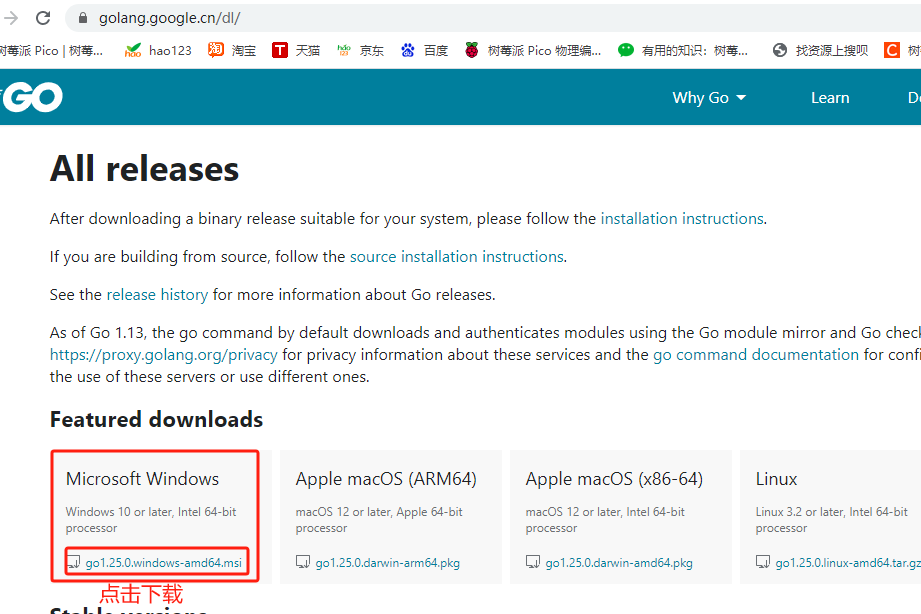
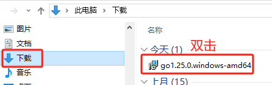
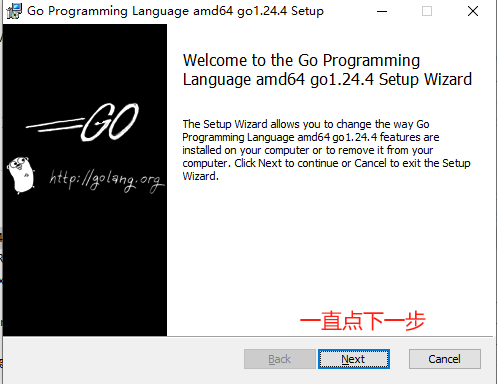
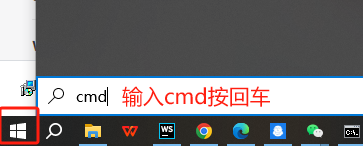
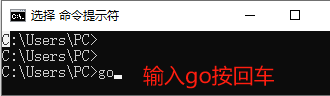
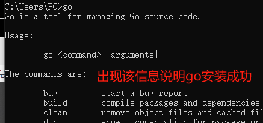

<MyButton />
<script setup>
import MyButton from '../../.vitepress/components/MyButton.vue'
</script>

# 1.1 下载go
[https://golang.google.cn/dl/](https://golang.google.cn/dl/) 


## 1.2 Windows安装go
1.双击

2.点击下一步

3.安装完成后，打开命令行

4.命令行中输入go按回车

5.验证安装成功


## 1.3 安装goland开发工具

## 1.4 第一个程序hello world
创建一个 Go 源文件 `hello.go`，内容如下：
```go
package main  //定义包名。Go 程序由若干 包（package） 组成，包里可以有很多的变量，函数
import "fmt"  //导入标准包 fmt，fmt能打印参数到控制台,go sdk有很多包，每个包有很多的函数
func main() { //程序入口main函数,程序从这里开始逐行执行
   //调用fmt包的输出函数，输出参数到控制台，函数是输入参数，能实现对应的功能
   fmt.Println("Hello, World!")  
}
```
命令行中输入go run hello.go回车运行程序
``` bash
go run hello.go
Hello, World! //控制台输出结果
```

## 1.5 注释
注释是程序中的说明文字，方便阅读，不会执行。
### 1.5.1 单行注释
```
func main() {
    // 这是单行注释
    fmt.Println("Hello, World!") // 这是单行注释
}
```
### 1.5.2 多行注释
```
func main() {
    /* 
       这是多行注释
       可以写多行文字说明代码逻辑
    */
    fmt.Println("Hello, World!")
}
```
