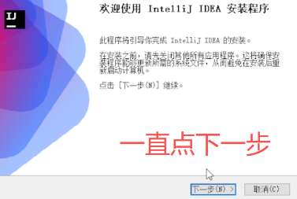
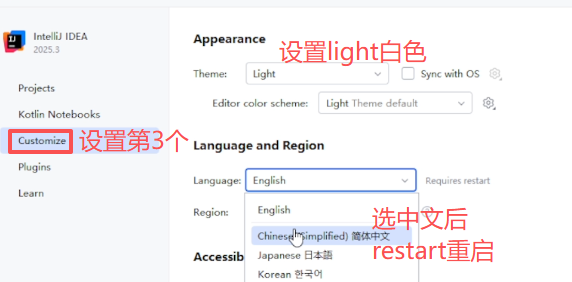
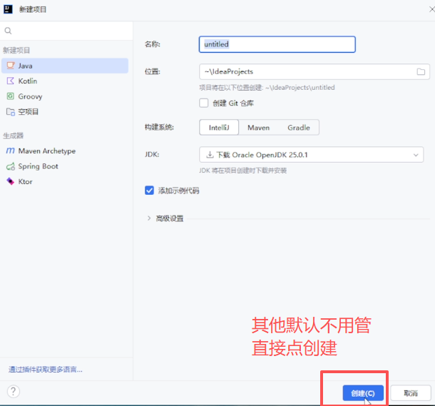
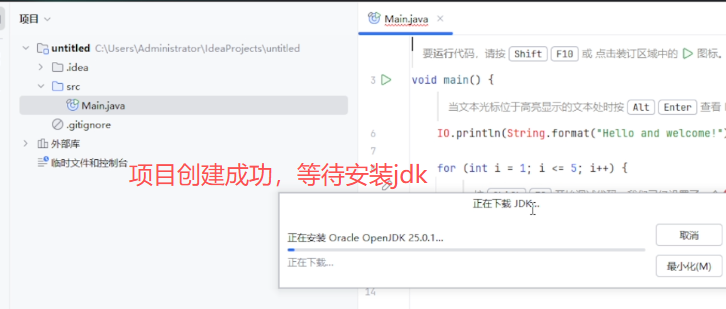
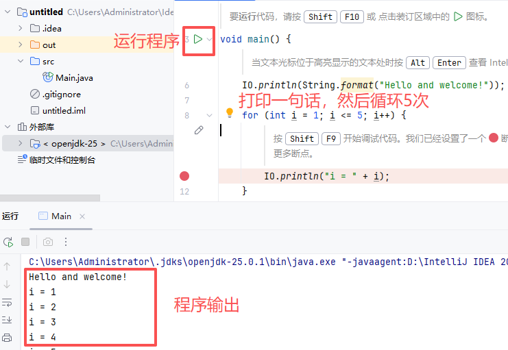

<VideoPlayer
src="https://commondatastorage.googleapis.com/gtv-videos-bucket/sample/BigBuckBunny.mp4"
poster="https://img1.baidu.com/it/u=2118850509,1265569087&fm=253&fmt=auto&app=138&f=JPEG?w=474&h=291"
/>

# 第一课：Java环境搭建
## 1.1 java编程介绍
java编程是操作计算和存储的指令,用于计算结果和存储结果

## 1.1 idea安装

| 步骤 | 操作                                                           | 截图提示 |
|----|--------------------------------------------------------------|-------|
| 1  | 打开点下载 → https://www.jetbrains.com/idea/download/?section=windows |  |
| 2  | 下载完双击安装 → 一直「下一步」→ 记住安装路径（默认就行）                              |  |

### 1.2 设置idea
安装完双击打开后设置颜色，中文后重启

### 1.3 创建项目

### 1.4.第一个程序
- mian函数:程序的入口，点击main绿色按钮可以运行程序
- IO.println() 是输出函数，运行程序能输出括号里面的内容
- 程序是一行一行有序执行
