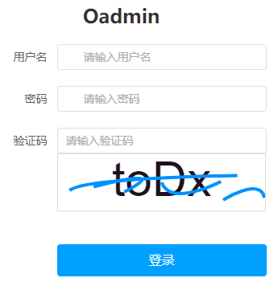
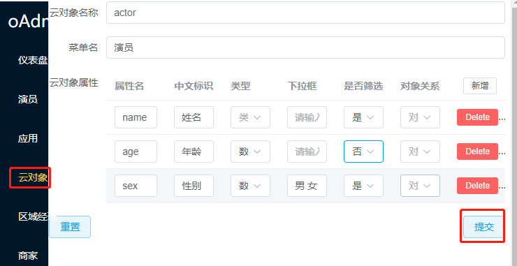
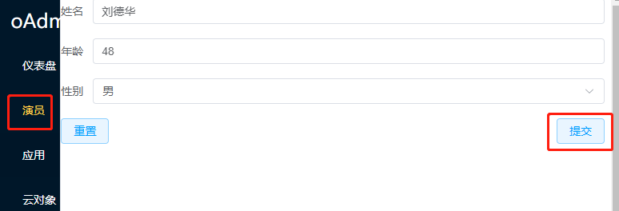
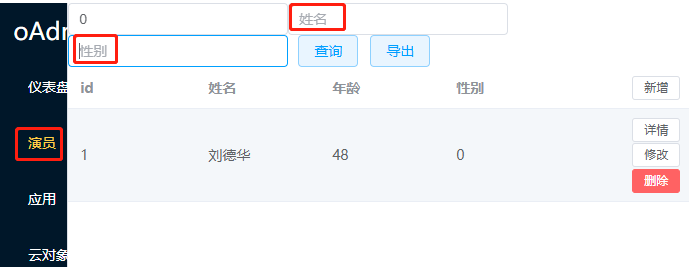

# ocloud云开发
## [创建项目](http://oop-dev.com/api/db/ocloud) 请点击
````bash
等待10秒自动跳转云端项目
````
## 登录：用户名:admin 密码:admin

## 新建演员云对象
如新增演员管理功能，演员有姓名，年龄，性别，如图创建个云对象，演员增删改查自动完成

## 新增演员

## 查询演员:可查列表，筛选查询，详情查询


今天研发不讲课
目标是移植pglite数据库到odb项目
pglite是postgre的wasm
好处是wasm可以嵌入到浏览器，和nodejs，bunjs，deno
不然postgre安装麻烦，上手难度高
